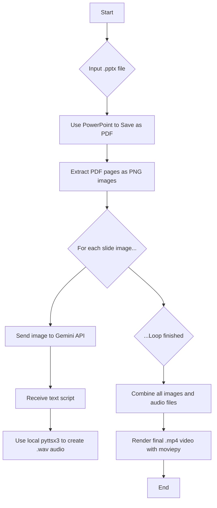
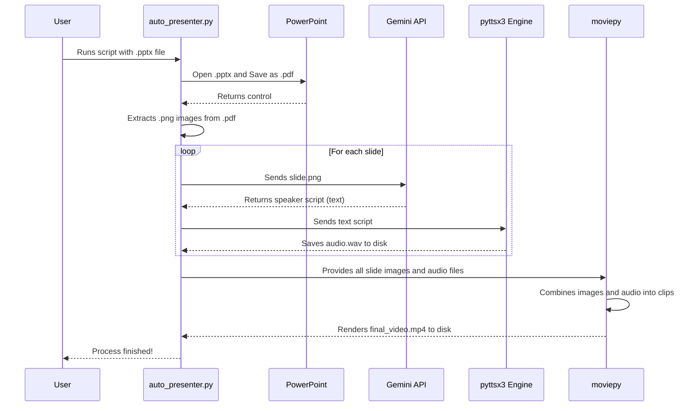

# Auto-Presenter: PPTX to Narrated Video

[](https://www.python.org/downloads/)
[](https://opensource.org/licenses/MIT)

A powerful Python script that automates the entire process of converting a PowerPoint (`.pptx`) presentation into a fully narrated video (`.mp4`).

This project uses a hybrid approach, leveraging the best of online AI for content generation and robust offline tools for media creation, ensuring reliability and avoiding API rate limits for media synthesis.

## Core Features

-   **High-Fidelity Slide Extraction**: Uses Microsoft PowerPoint itself to convert `.pptx` slides into a PDF, ensuring perfect visual fidelity, then extracts them as high-resolution images.
-   **AI-Powered Script Generation**: Sends each slide image to the **Google Gemini API** to generate a clear and engaging speaker script.
-   **Offline Text-to-Speech**: Utilizes the local `pyttsx3` engine to convert the generated scripts into audio narrations, avoiding TTS API rate limits and costs.
-   **Automatic Video Assembly**: Stitches the slide images and their corresponding audio files together into a final `.mp4` video using `moviepy`.
-   **Resilient & Intelligent**: The script is designed to be resumable. If it's interrupted, it will skip any slides it has already processed, saving time and API calls.

## Workflow Diagram

This diagram illustrates the end-to-end process automated by the script.



## Prerequisites

Before you begin, ensure you have the following installed and configured:

1.  **Windows Operating System**: This script uses COM automation, which requires Windows.
2.  **Microsoft PowerPoint**: Must be installed on your machine for the initial PDF conversion step.
3.  **Python**: Version 3.9 or newer is recommended.
4.  **Google Gemini API Key**:
    -   Go to [Google AI Studio](https://aistudio.google.com/).
    -   Click "Get API Key" and create a new key.

## Installation & Setup

Follow these steps to set up the project on your local machine. Using a virtual environment is strongly recommended to avoid conflicts with other projects.

**1. Clone the Repository**
```bash
git clone https://github.com/your-username/your-repository-name.git
cd your-repository-name
```

**2. Create and Activate a Virtual Environment**
This creates an isolated environment for the project's dependencies.
```bash
# Create the virtual environment
python -m venv venv

# Activate it (you'll need to do this every time you work on the project)
.\venv\Scripts\Activate.ps1
```
> **Note:** If you get an error about script execution being disabled, run `Set-ExecutionPolicy Unrestricted -Scope Process` and then try activating again.

**3. Install Dependencies**
This command uses the `requirements.txt` file to install all the necessary libraries into your active virtual environment.
```bash
pip install -r requirements.txt
```

**4. Configure API Key**
Open the `auto_presenter.py` file in a text editor and find the configuration section at the top. Paste your Gemini API key into the variable.

```python
# --- CONFIGURATION ---
# Your Gemini API Key for script generation
GEMINI_API_KEY = "YOUR_GEMINI_API_KEY_HERE"
```
> **Security Warning:** Never commit your API key directly to a public GitHub repository. Ensure your `.gitignore` file includes the script if you've pasted in your key.

## Usage

Once everything is set up, you can run the script from your terminal. Make sure your virtual environment is activated.

The script takes one argument: the path to your `.pptx` file.

```bash
# Example
python auto_presenter.py "My Presentation.pptx"

# Example with a path
python auto_presenter.py "C:\Users\YourUser\Documents\Presentations\My Presentation.pptx"
```

The script will create a temporary folder (`_temp_files`), generate all the assets, and output the final `.mp4` video in the same directory as your original presentation.

## How It Works: A Deeper Look

The script's logic is broken down into several functions that interact with each other.



## Troubleshooting

-   **`ModuleNotFoundError`**: This is the most common issue and is almost always caused by not having the virtual environment activated. Ensure you see `(venv)` at the start of your command prompt before running `pip install` or `python`. If the problem persists, your Python installation may be corrupted.
-   **COM Error / PowerPoint Error**: Ensure Microsoft PowerPoint is fully installed and that you are running the script on Windows.
-   **API Errors**: Double-check that your Gemini API key is correctly pasted into the script.

## License

This project is licensed under the MIT License - see the [LICENSE.md](LICENSE.md) file for details.
