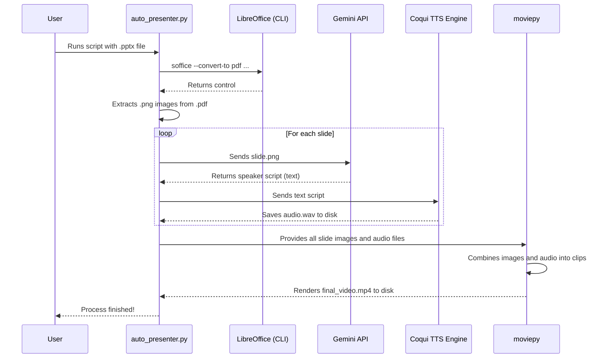

# Auto-Presenter: PPTX to Narrated Video (Cloud-Ready)

[](https://github.com/features/codespaces)
[](https://www.python.org/downloads/)
[](https://opensource.org/licenses/MIT)

A powerful, platform-independent Python script that automates the entire process of converting a PowerPoint (`.pptx`) presentation into a fully narrated video (`.mp4`).

This project is designed to run in a cloud development environment like **GitHub Codespaces**, using a hybrid approach that leverages the best of online AI for content generation and robust offline tools for media creation.

## Core Features

-   **Cross-Platform Slide Extraction**: Uses a headless instance of **LibreOffice** to convert `.pptx` slides into a PDF, ensuring perfect visual fidelity on any operating system.
-   **AI-Powered Script Generation**: Sends each slide image to the **Google Gemini API** to generate a clear and engaging speaker script.
-   **High-Quality Offline Text-to-Speech**: Utilizes the powerful **Coqui TTS** engine to convert scripts into natural-sounding audio narrations, avoiding API rate limits and costs.
-   **Cloud-Ready with Dev Containers**: Comes with a pre-configured `.devcontainer` that automatically sets up the entire environment (LibreOffice, Python, all libraries) when launched in Codespaces.
-   **Automatic Video Assembly**: Stitches the slide images and their corresponding audio files together into a final `.mp4` video using `moviepy`.
-   **Resilient & Intelligent**: The script is resumable. If interrupted, it will skip any slides it has already processed, saving time and API calls.

## Workflow Diagram

This diagram illustrates the new, cross-platform architecture.

```mermaid
graph TD
    A[Start] --> B{Input .pptx file};
    B --> C[Use LibreOffice (headless) to Save as PDF];
    C --> D[Extract PDF pages as PNG images];
    D --> E{For each slide image...};
    E --> F[Send image to Gemini API];
    F --> G[Receive text script];
    G --> H[Use local Coqui TTS to create .wav audio];
    E --> I{...Loop finished};
    I --> J[Combine all images and audio files];
    J --> K[Render final .mp4 video with moviepy];
    K --> L[End];
```

## Prerequisites

1.  **GitHub Account**: Required to use GitHub Codespaces.
2.  **Google Gemini API Key**:
    -   Go to [Google AI Studio](https://aistudio.google.com/).
    -   Click "Get API Key" and create a new key.

## Installation & Setup (via GitHub Codespaces)

This project is optimized for a one-click setup using GitHub Codespaces.

**1. Launch the Codespace**
-   Navigate to the project's repository on GitHub.
-   Click the green **`< > Code`** button.
-   Go to the **Codespaces** tab and click **"Create codespace on main"**.

**2. Automatic Setup**
-   Wait a few minutes while Codespaces builds your environment. It will automatically:
    -   Install LibreOffice.
    -   Install Python 3.11.
    -   Install all necessary Python libraries from `requirements.txt`.

**3. Configure API Key**
-   Once the Codespace has loaded, the `auto_presenter.py` file will be visible in the file explorer.
-   Open it and find the configuration section at the top. Paste your Gemini API key into the variable.

```python
# --- CONFIGURATION ---
# Your Gemini API Key for script generation
GEMINI_API_KEY = "YOUR_GEMINI_API_KEY_HERE"
```

## Usage

Once the setup is complete, you can run the script from the terminal inside your Codespace.

**1. Upload Your Presentation**
-   Drag and drop your `.pptx` file from your computer into the file explorer on the left side of your Codespace.

**2. Run the Script**
-   In the Codespace terminal, run the script with the name of your presentation as the argument.

```bash
# Example
python auto_presenter.py "My Presentation.pptx"
```

**3. Download the Video**
-   The script will create a temporary folder, generate all assets, and output the final `.mp4` video.
-   Once finished, the `presentation.mp4` file will appear in your file explorer. Right-click it and select **Download** to save it to your local machine.

## How It Works: A Deeper Look



## Troubleshooting

-   **Codespace Build Fails**: This can sometimes happen if there's a network issue during setup. Try rebuilding the codespace (from the Codespaces dashboard).
-   `soffice command not found`: This means the LibreOffice installation failed during the Codespace build. Check the `postCreateCommand` in the `.devcontainer/devcontainer.json` file and rebuild.
-   **API Errors**: Double-check that your Gemini API key is correctly pasted into the script.

## License

This project is licensed under the MIT License - see the [LICENSE.md](LICENSE.md) file for details.