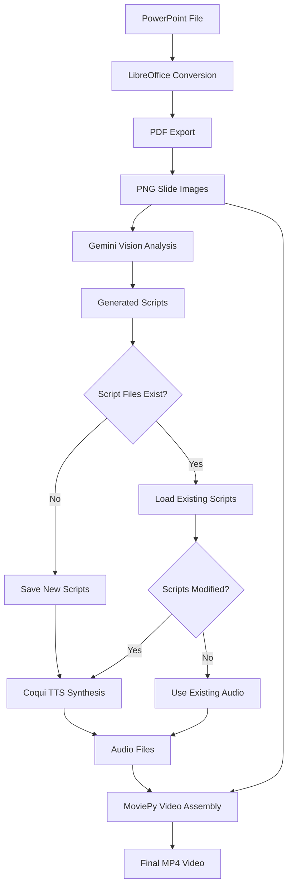
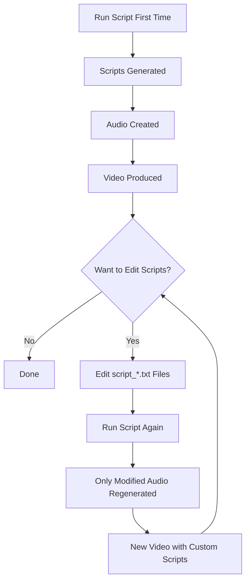
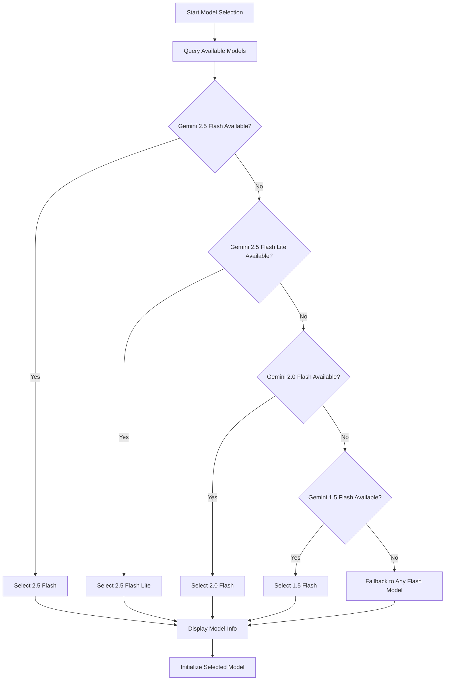
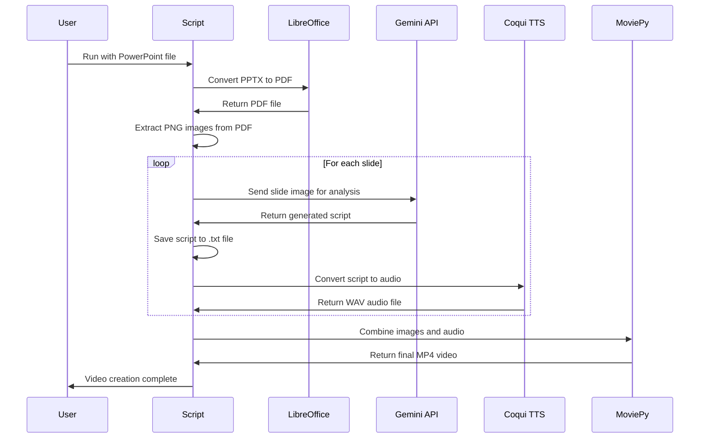
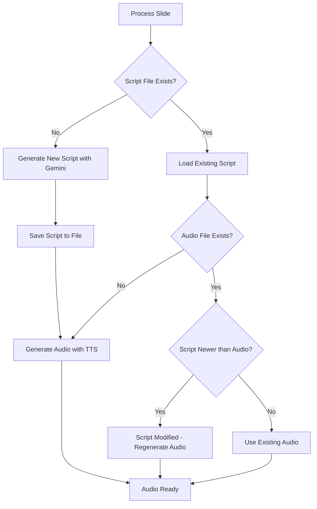
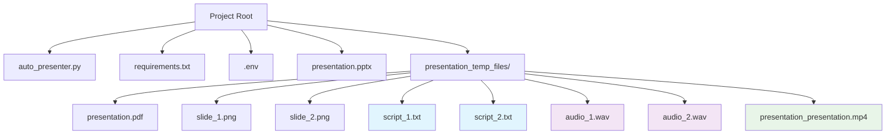

# PowerPoint to Video Auto-Presenter

Automatically convert PowerPoint presentations into narrated videos using AI-generated scripts and text-to-speech synthesis.

## Features

- **Cross-platform PowerPoint conversion** using LibreOffice (Linux compatible)
- **AI-powered script generation** using Google's Gemini models
- **Intelligent model selection** - automatically chooses the best available Gemini model
- **High-quality offline text-to-speech** using Coqui TTS
- **Editable scripts** - manually edit generated scripts and regenerate audio
- **Incremental processing** - only regenerates content when scripts are modified
- **Professional video output** with multiple codec fallbacks

## Architecture Overview



## Requirements

- Python 3.11+
- Google Gemini API key (free tier available)
- LibreOffice (for PowerPoint conversion)
- FFmpeg (for video encoding)

## Installation

1. Clone the repository:
    ```bash
    git clone <repository-url>
    cd powerpoint-to-video
    ```

2. Install Python dependencies:
    ```bash
    pip install -r requirements.txt
    ```

3. Set up your Gemini API key:
   - Get a free API key from [Google AI Studio](https://aistudio.google.com/app/apikey)
   - Create a `.env` file in the project root:
    ```bash
    GEMINI_API_KEY=your_api_key_here
    ```

## Usage

### Basic Usage

Convert a PowerPoint presentation to video:

```bash
python auto_presenter.py presentation.pptx
```

### Advanced Workflow



1. **First run** - Generate initial scripts and audio:
    ```bash
    python auto_presenter.py "My Presentation.pptx"
    ```

2. **Edit scripts** (optional):
   - Navigate to the `{filename}_temp_files/` folder
   - Edit any `script_*.txt` files to customize the narration
   - Save your changes

3. **Regenerate with custom scripts**:
    ```bash
    python auto_presenter.py "My Presentation.pptx"
    ```
   - Only slides with modified scripts will have their audio regenerated
   - Unchanged slides are processed quickly

## How It Works

### 1. Intelligent Model Selection



The script automatically selects the best available Gemini model for your use case:

**Priority Order:**
1. **Gemini 2.5 Flash** - Latest model with adaptive thinking
2. **Gemini 2.5 Flash Lite** - Most cost-efficient for high throughput
3. **Gemini 2.0 Flash** - Next-generation features
4. **Gemini 1.5 Flash** - Proven reliability and speed

**Model Information Display:**
- Shows all available models in your account
- Explains why each model was selected
- Optimizes for high-volume batch processing

**Rate Limits (Free Tier):**
- Flash models: 15 requests/minute, 1000/day
- Pro models: 2 requests/minute, 50/day
- Perfect for processing multiple presentations

### 2. Slide Processing Pipeline



1. **PowerPoint Conversion**: LibreOffice converts `.pptx` → PDF → PNG images
2. **Script Generation**: Gemini analyzes each slide image and generates contextual narration
3. **Script Storage**: Scripts saved as editable `.txt` files in temp folder
4. **Audio Synthesis**: Coqui TTS converts scripts to high-quality speech
5. **Video Assembly**: MoviePy combines slides and audio into final video

### 3. Smart Script Management



**Context-Aware Generation:**
- **First slide**: Includes greeting and topic introduction
- **Middle slides**: Focuses on content without repetitive introductions
- **Final slide**: Provides professional closing and summary

**Manual Editing Support:**
- Scripts saved as `script_1.txt`, `script_2.txt`, etc.
- Edit any script file with your preferred text editor
- Timestamp comparison ensures only modified scripts regenerate audio
- Preserves existing audio for unchanged slides

### 4. Robust Video Output

**Multiple Encoding Fallbacks:**
1. Primary: H.264 with AAC audio
2. Alternative: H.264 with ultrafast preset
3. Fallback: MP4V codec for maximum compatibility

**Quality Settings:**
- 300 DPI slide images for crisp visuals
- 24 FPS video output
- High-quality audio synthesis

## File Structure



```
project/
├── auto_presenter.py          # Main script
├── requirements.txt           # Python dependencies
├── .env                      # API keys (create this)
├── presentation.pptx         # Your input file
└── presentation_temp_files/  # Generated during processing
    ├── presentation.pdf      # Intermediate PDF
    ├── slide_1.png          # Slide images
    ├── slide_2.png
    ├── script_1.txt         # Editable scripts 📝
    ├── script_2.txt
    ├── audio_1.wav          # Generated audio 🎵
    ├── audio_2.wav
    └── presentation_presentation.mp4  # Final video 🎬
```

## Processing Timeline

```mermaid
gantt
    title PowerPoint to Video Processing Timeline
    dateFormat X
    axisFormat %s
    
    section Conversion
    PPTX to PDF    :0, 5
    PDF to Images  :5, 10
    
    section AI Processing
    Script Gen Slide 1 :10, 15
    Script Gen Slide 2 :15, 20
    Script Gen Slide N :20, 25
    
    section Audio Synthesis
    TTS Slide 1    :25, 35
    TTS Slide 2    :30, 40
    TTS Slide N    :35, 45
    
    section Video Assembly
    Combine Assets :45, 55
    Encode Video   :50, 60
```



## Customization

### Script Editing Tips

1. **Keep scripts concise** - Aim for 100-150 words per slide
2. **Natural speech patterns** - Write as you would speak
3. **Smooth transitions** - Reference previous slides when appropriate
4. **Professional tone** - Match your presentation style

### TTS Voice Options

The script uses Coqui TTS with LJSpeech model by default. To use different voices:

```python
# In auto_presenter.py, modify the TTS initialization:
tts_engine = TTS("tts_models/en/vctk/vits")  # Multi-speaker model
# or
tts_engine = TTS("tts_models/en/jenny/jenny")  # Different voice
```

## Troubleshooting

### Common Issues

**LibreOffice not found:**
```bash
sudo apt-get update && sudo apt-get install -y libreoffice
```

**FFmpeg encoding errors:**
```bash
sudo apt-get install -y ffmpeg
```

**Gemini API errors:**
- Verify your API key in `.env`
- Check rate limits (wait if exceeded)
- Ensure billing is enabled for higher limits

**TTS model download fails:**
- Check internet connection
- Clear Coqui cache: `rm -rf ~/.local/share/tts/`

### Performance Tips

1. **Use Flash models** for high-volume processing
2. **Edit scripts incrementally** - only modified slides regenerate
3. **Monitor rate limits** - Flash models handle 15 requests/minute
4. **Process smaller batches** if hitting limits

## Contributing

1. Fork the repository
2. Create a feature branch
3. Make your changes
4. Test with various PowerPoint files
5. Submit a pull request

## License

This project is licensed under the MIT License - see the LICENSE file for details.

## Acknowledgments

- Google Gemini API for intelligent script generation
- Coqui TTS for high-quality speech synthesis
- LibreOffice for cross-platform PowerPoint conversion
- MoviePy for video processing capabilities