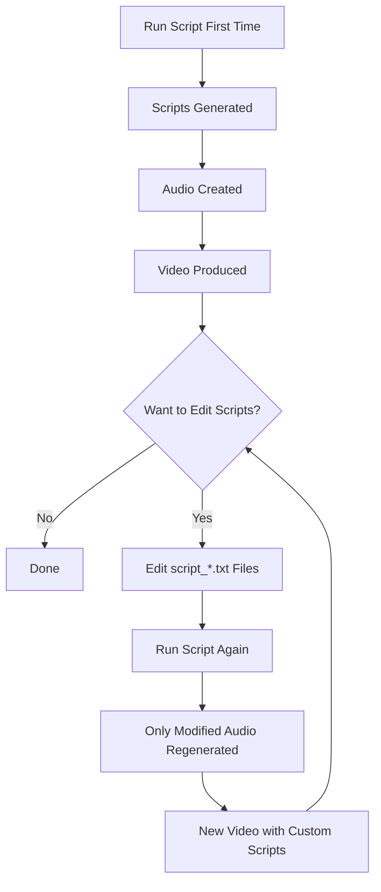
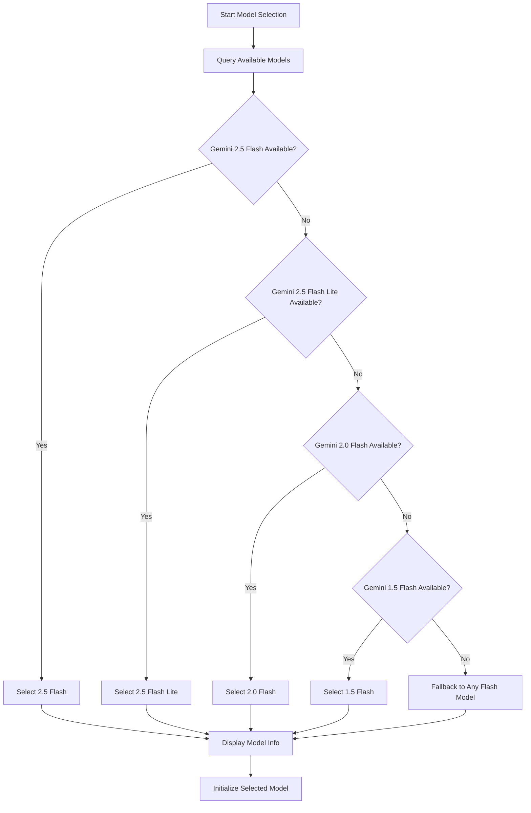
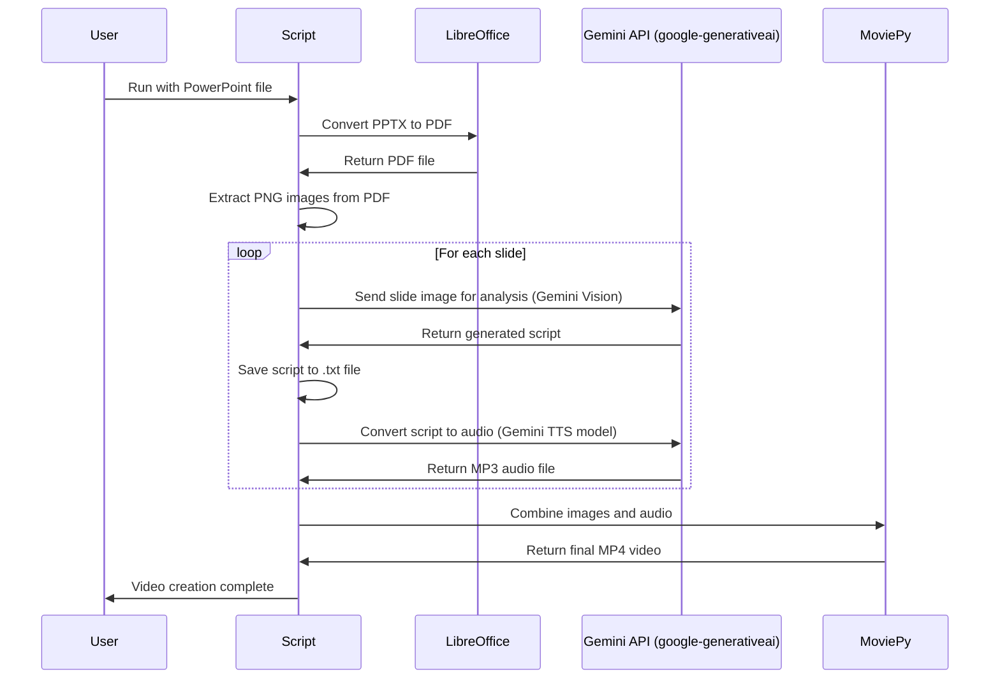
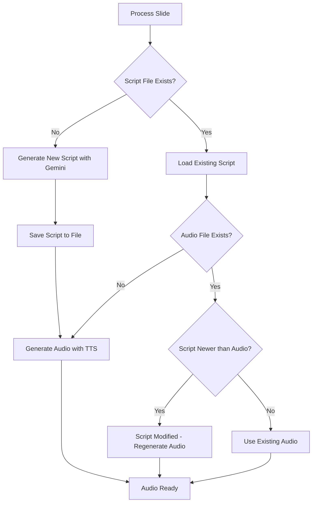
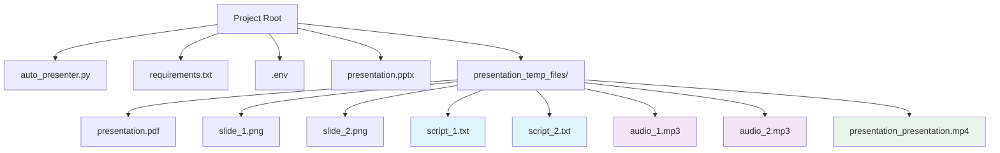

# PowerPoint to Video Auto-Presenter

Automatically convert PowerPoint presentations into narrated videos using AI-generated scripts and text-to-speech synthesis.

## Features

- **Cross-platform PowerPoint conversion** using LibreOffice (Linux compatible)
- **AI-powered script generation** using Google's Gemini models.
- **Intelligent model selection** for script generation.
- **High-quality text-to-speech** using Google's Gemini models (e.g., `gemini-2.5-flash-preview-tts`) via the `google-generativeai` SDK.
- **Editable scripts** - manually edit generated scripts and regenerate audio.
- **Incremental processing** - only regenerates content when scripts are modified
- **Professional video output** with multiple codec fallbacks

## Architecture Overview

```mermaid
graph TB
    A[PowerPoint File] --> B[LibreOffice Conversion]
    B --> C[PDF Export]
    C --> D[PNG Slide Images]
    D --> E[Gemini Vision Analysis]
    E --> F[Generated Scripts]
    F --> G{Script Files Exist?}
    G -->|No| H[Save New Scripts]
    G -->|Yes| I[Load Existing Scripts]
    H --> J[Gemini TTS Synthesis (google-generativeai)]
    I --> K{Scripts Modified?}
    K -->|Yes| J
    K -->|No| L[Use Existing Audio]
    J --> M[Audio Files (.mp3)]
    L --> M
    M --> N[MoviePy Video Assembly]
    D --> N
    N --> O[Final MP4 Video]
```

## Requirements

- Python 3.11+
- Google Gemini API key (set via `.env` file, used for both script generation and Text-to-Speech).
- LibreOffice (for PowerPoint conversion).
- FFmpeg (for video encoding).

## Installation

1. Clone the repository:
    ```bash
    git clone <repository-url>
    cd powerpoint-to-video
    ```

2. Install Python dependencies:
    ```bash
    pip install -r requirements.txt
    ```

3. Set up your Gemini API key:
   - Get a free API key from [Google AI Studio](https://aistudio.google.com/app/apikey)
   - Create a `.env` file in the project root:
    ```bash
    GEMINI_API_KEY=your_api_key_here
    ```
   (This API key will be used for both script generation and Text-to-Speech)

## Usage

### Basic Usage

Convert a PowerPoint presentation to video:

```bash
python auto_presenter.py presentation.pptx
```

### Advanced Workflow


```mermaid
flowchart TD
    A[Run Script First Time] --> B[Scripts Generated]
    B --> C[Audio Created]
    C --> D[Video Produced]
    D --> E{Want to Edit Scripts?}
    E -->|No| F[Done]
    E -->|Yes| G[Edit script_*.txt Files]
    G --> H[Run Script Again]
    H --> I[Only Modified Audio Regenerated]
    I --> J[New Video with Custom Scripts]
    J --> E
```

1. **First run** - Generate initial scripts and audio:
    ```bash
    python auto_presenter.py "My Presentation.pptx"
    ```

2. **Edit scripts** (optional):
   - Navigate to the `{filename}_temp_files/` folder
   - Edit any `script_*.txt` files to customize the narration
   - Save your changes

3. **Regenerate with custom scripts**:
    ```bash
    python auto_presenter.py "My Presentation.pptx"
    ```
   - Only slides with modified scripts will have their audio regenerated
   - Unchanged slides are processed quickly

## How It Works

### 1. Intelligent Model Selection


```mermaid
graph TD
    A[Start Model Selection] --> B[Query Available Models]
    B --> C{Gemini 2.5 Flash Available?}
    C -->|Yes| D[Select 2.5 Flash]
    C -->|No| E{Gemini 2.5 Flash Lite Available?}
    E -->|Yes| F[Select 2.5 Flash Lite]
    E -->|No| G{Gemini 2.0 Flash Available?}
    G -->|Yes| H[Select 2.0 Flash]
    G -->|No| I{Gemini 1.5 Flash Available?}
    I -->|Yes| J[Select 1.5 Flash]
    I -->|No| K[Fallback to Any Flash Model]
    D --> L[Display Model Info]
    F --> L
    H --> L
    J --> L
    K --> L
    L --> M[Initialize Selected Model]
```

The script automatically selects the best available Gemini model for your use case:

**Priority Order:**
1. **Gemini 2.5 Flash** - Latest model with adaptive thinking
2. **Gemini 2.5 Flash Lite** - Most cost-efficient for high throughput
3. **Gemini 2.0 Flash** - Next-generation features
4. **Gemini 1.5 Flash** - Proven reliability and speed

**Model Information Display:**
- Shows all available models in your account
- Explains why each model was selected
- Optimizes for high-volume batch processing

**Rate Limits (Free Tier):**
- Flash models: 15 requests/minute, 1000/day
- Pro models: 2 requests/minute, 50/day
- Perfect for processing multiple presentations

### 2. Slide Processing Pipeline


```mermaid
sequenceDiagram
    participant U as User
    participant S as Script
    participant L as LibreOffice
    participant G_API as Gemini API (google-generativeai)
    participant M as MoviePy

    U->>S: Run with PowerPoint file
    S->>L: Convert PPTX to PDF
    L->>S: Return PDF file
    S->>S: Extract PNG images from PDF
    
    loop For each slide
        S->>G_API: Send slide image for analysis (Gemini Vision)
        G_API->>S: Return generated script
        S->>S: Save script to .txt file
        S->>G_API: Convert script to audio (Gemini TTS model)
        G_API->>S: Return MP3 audio file
    end
    
    S->>M: Combine images and audio
    M->>S: Return final MP4 video
    S->>U: Video creation complete
```

1. **PowerPoint Conversion**: LibreOffice converts `.pptx` → PDF → PNG images.
2. **Script Generation**: A Gemini vision model (e.g., Gemini Flash) analyzes each slide image and generates contextual narration.
3. **Script Storage**: Scripts are saved as editable `.txt` files in a temporary folder.
4. **Audio Synthesis**: A Gemini Text-to-Speech model (e.g., `gemini-2.5-flash-preview-tts`) converts scripts to speech using the `google-generativeai` SDK.
5. **Video Assembly**: MoviePy combines slide images and the generated MP3 audio files into the final video.

### 3. Smart Script Management


```mermaid
flowchart TD
    A[Process Slide] --> B{Script File Exists?}
    B -->|No| C[Generate New Script with Gemini]
    B -->|Yes| D[Load Existing Script]
    C --> E[Save Script to File]
    D --> F{Audio File Exists?}
    E --> G[Generate Audio with TTS]
    F -->|No| G
    F -->|Yes| H{Script Newer than Audio?}
    H -->|Yes| I[Script Modified - Regenerate Audio]
    H -->|No| J[Use Existing Audio]
    I --> K[Audio Ready]
    G --> K
    J --> K
```

**Context-Aware Generation:**
- **First slide**: Includes greeting and topic introduction
- **Middle slides**: Focuses on content without repetitive introductions
- **Final slide**: Provides professional closing and summary

**Manual Editing Support:**
- Scripts saved as `script_1.txt`, `script_2.txt`, etc.
- Edit any script file with your preferred text editor
- Timestamp comparison ensures only modified scripts regenerate audio
- Preserves existing audio for unchanged slides

### 4. Robust Video Output

**Multiple Encoding Fallbacks:**
1. Primary: H.264 with AAC audio
2. Alternative: H.264 with ultrafast preset
3. Fallback: MP4V codec for maximum compatibility

**Quality Settings:**
- 300 DPI slide images for crisp visuals
- 24 FPS video output
- High-quality audio synthesis

## File Structure


```mermaid
graph TD
    A[Project Root] --> B[auto_presenter.py]
    A --> C[requirements.txt]
    A --> D[.env]
    A --> E[presentation.pptx]
    A --> F[presentation_temp_files/]
    
    F --> G[presentation.pdf]
    F --> H[slide_1.png]
    F --> I[slide_2.png]
    F --> J[script_1.txt]
    F --> K[script_2.txt]
    F --> L[audio_1.mp3]
    F --> M[audio_2.mp3]
    F --> N[presentation_presentation.mp4]
    
    style J fill:#e1f5fe
    style K fill:#e1f5fe
    style L fill:#f3e5f5
    style M fill:#f3e5f5
    style N fill:#e8f5e8
```

```
project/
├── auto_presenter.py          # Main script
├── requirements.txt           # Python dependencies
├── .env                      # API keys (create this)
├── presentation.pptx         # Your input file
└── presentation_temp_files/  # Generated during processing
    ├── presentation.pdf      # Intermediate PDF
    ├── slide_1.png          # Slide images
    ├── slide_2.png
    ├── script_1.txt         # Editable scripts 📝
    ├── script_2.txt
    ├── audio_1.mp3          # Generated audio (MP3 format) 🎵
    ├── audio_2.mp3
    └── presentation_presentation.mp4  # Final video 🎬
```

## Processing Timeline


```mermaid
gantt
    title PowerPoint to Video Processing Timeline
    dateFormat X
    axisFormat %s
    
    section Conversion
    PPTX to PDF    :0, 5
    PDF to Images  :5, 10
    
    section AI Processing
    Script Gen Slide 1 :10, 15
    Script Gen Slide 2 :15, 20
    Script Gen Slide N :20, 25
    
    section Audio Synthesis
    TTS Slide 1    :25, 35
    TTS Slide 2    :30, 40
    TTS Slide N    :35, 45
    
    section Video Assembly
    Combine Assets :45, 55
    Encode Video   :50, 60
```

## Customization

### Script Editing Tips

1. **Keep scripts concise** - Aim for 100-150 words per slide
2. **Natural speech patterns** - Write as you would speak
3. **Smooth transitions** - Reference previous slides when appropriate
4. **Professional tone** - Match your presentation style

### TTS Voice Options

The script uses Google's Gemini models for Text-to-Speech via the `google-generativeai` SDK.
- **TTS Model**: Defaults to `models/gemini-2.5-flash-preview-tts`. This can be changed by modifying the `tts_gemini_model_name` variable in the `main()` function within `auto_presenter.py`.
- **Voice Speaker**: Defaults to the prebuilt voice named `"Kore"`. This can be changed by modifying the `default_tts_voice_speaker` variable in `main()`, which is then passed to the `synthesize_speech_with_gemini_model` function.

Example of changing the voice speaker in `auto_presenter.py`:
```python
# In auto_presenter.py, at the beginning of the main() function:
# tts_gemini_model_name = "models/gemini-2.5-pro-preview-tts" # If you want to try the Pro TTS model
default_tts_voice_speaker = "Puck" # Change to another prebuilt voice like Puck

# ... later in the loop ...
synthesized_audio = synthesize_speech_with_gemini_model(
    script, audio_path, slide_num,
    tts_model_name=tts_gemini_model_name,
    voice_speaker_name=default_tts_voice_speaker
)
```

The `google.generativeai.types.PrebuiltVoiceConfig` is used. Refer to the `google-generativeai` SDK documentation for available prebuilt voice names (like 'Kore', 'Puck', etc.) that can be used with the `voice_name` parameter in `PrebuiltVoiceConfig`. The example provided by the user also shows how `MultiSpeakerVoiceConfig` could be used for more complex scenarios, though this script currently implements single-speaker narration per slide.

## Troubleshooting

### Common Issues

**LibreOffice not found:**
```bash
sudo apt-get update && sudo apt-get install -y libreoffice
```

**FFmpeg encoding errors:**
```bash
sudo apt-get install -y ffmpeg
```

**Gemini API errors:**
- Verify your `GEMINI_API_KEY` in `.env` is correct and has access to the required Gemini models (for both vision and TTS).
- **Rate Limits:** Check if you've exceeded API rate limits for the Gemini models.
- **Billing:** Ensure billing is enabled for your Google Cloud project associated with the API key if using paid tiers or models.
- **Model Access:** Confirm that the specific Gemini TTS model (e.g., `models/gemini-2.5-flash-preview-tts`) is available to your API key. Preview models might have restricted access.
- **Invalid Voice Speaker Name:** If you change `default_tts_voice_speaker`, ensure the name is valid according to `google-generativeai` SDK's `PrebuiltVoiceConfig` options.

### Performance Tips

1. **Use Flash models** for high-volume processing
2. **Edit scripts incrementally** - only modified slides regenerate
3. **Monitor rate limits** - Flash models handle 15 requests/minute
4. **Process smaller batches** if hitting limits

## Contributing

1. Fork the repository
2. Create a feature branch
3. Make your changes
4. Test with various PowerPoint files
5. Submit a pull request

## License

This project is licensed under the MIT License - see the LICENSE file for details.

## Acknowledgments

- Google Gemini API (via `google-generativeai` SDK) for intelligent script generation and Text-to-Speech.
- LibreOffice for cross-platform PowerPoint conversion.
- MoviePy for video processing capabilities.